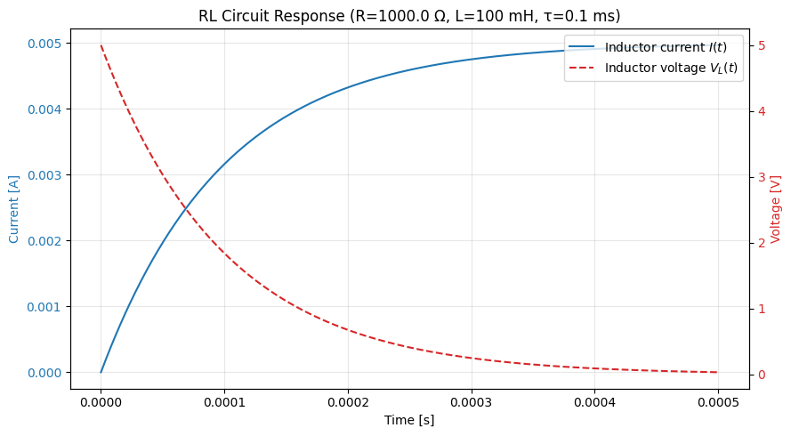
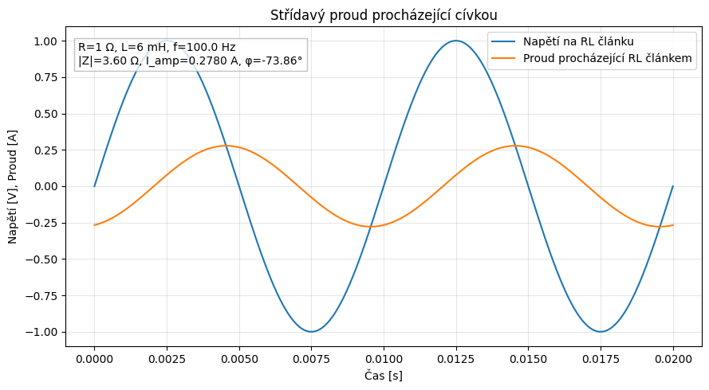
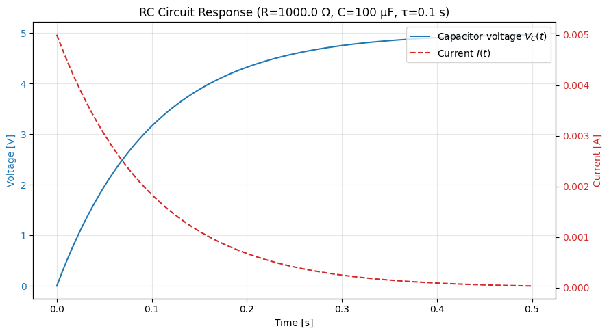
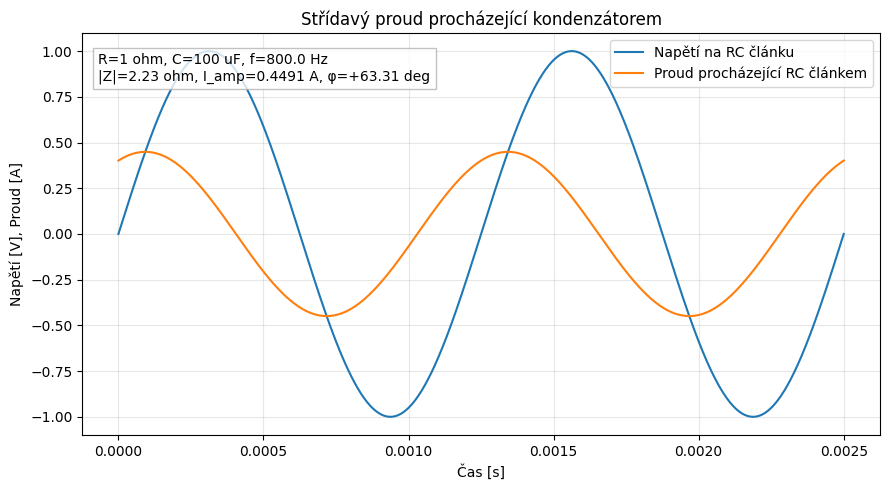

# Otázka 13 - Pasivní elektronické prvky

## Slovo úvodem

Na rozdíl od aktivních prvků (o kterých si povíme v další otázce), pasivní součástky do obvodu nemohou dodávat el. energii. Mohou ji jen ukládat či měnit. Mezi základní trojici řadíme rezistor, cívku a kondenzátor. Z nich lze skládat složitější struktury (filtry, rezonanční obvody, transformátory, ...).

Z polovodičových prvků v pasivní kategorii najdeme diody a různé součástky závislé na nějaké fyzikální veličině (teplota, světlo, ...), kde se změna této veličiny často projevuje změnou el. odporu (termistor, fotorezistor, ...). Společným znakem těchto polovodičových pasivních prvků je, že jsou (na rozdíl od základní trojice) nelineární.

---

## Lineární pasivní prvky

### Rezistory
- hlavní vlastností je elektrický odpor $R$, jednotka: $Ohm [\Omega]$, po něm. fyzikovi [Georgu Simonu Ohmovi](https://cs.wikipedia.org/wiki/Georg_Simon_Ohm)
- při **sériovém** zapojení rezistorů se velikostí elektrických odporů sčítají: $R=R_{1}+R_{2}+ \dots +R_{n}$
- při **paralelním** zapojení rezistorů se sčítají **vodivosti** (převrácené hodnoty velikosti elektrických odporů): $G = G_1 + G_2 + \dots + G_n$, tedy $\frac{1}{R}=\frac{1}{R_{1}}+\frac{1}{R_{2}}+ \dots +\frac{1}{R_{n}}$

> **Poznámka**: Proč se při paralelním zapojení sčítají vodivosti? Protože vodivost je převrácenou hodnotou odporu, tedy $G = \frac{1}{R}$. Když máme dva rezistory zapojené paralelně, proud se dělí mezi ně, a proto je logické, že se sčítají jejich vodivosti (schopnost vést proud), nikoli jejich odpory (schopnost klást odpor proudu). Vodivost má jednotku Siemens [S], po něm. fyzikovi [Ernstu Werneru von Siemensovi](https://cs.wikipedia.org/wiki/Werner_von_Siemens).

#### Užití
- omezení maximálního proudu protékajícího obvodem
- dělení napětí/proudu
- převod elektrické energie na teplo (topné těleso, žárovka, ...)
- převod elektrických veličin pro jejich měření(proud -> napětí)

#### Ideální rezistor
- tepelně nezávislý
- bez parazitních vlatností (kapacitance, induktance)

#### Reálný rezistor
- mírné parazitní vlastnosti, projevují se hlavně při vysokých frekvencích
- odpor je závislý na teplotě, s rostoucí teplotou se elektrický odpor zvětšuje $R=R_{0}(1+\alpha\Delta t)$

> Proč se odpor s rostoucí teplotou zvětšuje? Protože s rostoucí teplotou se zvyšuje tepelný pohyb atomů v materiálu, což způsobuje častější srážky elektronů s těmito atomy. Tyto srážky ztěžují průchod elektrického proudu, což se projevuje jako zvýšení odporu. OVšem pozor na polovočiče, tam je to naopak.

#### Častá zapojení

- **Předřadný odpor** - zapojuje se před citlivé součástky k omezení maximálního proudu, např. před detekční trubici Geigerova-Müllerova počítače, aby nedošlo k jejímu poškození

> A nebo taky před LEDku. Červená LED svítí při 1,2 V, protéká jí proud 15 mA. Jaký odpor potřebujeme, když ji chceme připojit k 3.3 V napájení z Raspberry Pi? $R = \frac{U}{I} = \frac{3.3 V - 1.2 V}{0.015 A} = 140 \Omega$.

- **Bočník** - obvykle nízkoohmový rezistor zapojený paralelně k měřícímu přístroji (ampérmetru), aby skrz měřicí přístroj protékala jen část proudu, čímž se zvětšuje měřicí rozsah přístroje. Jedná se tak vlastně o **proudový dělič**. 

- **Dělič napětí** - dělí přivedené napětí v daném poměru. Proud větví je společný ($I$, jelokož $R_{1}$ a $R_{2}$ jsou v sérii). Napětí na jednotlivých rezistorech se dělí v poměru jejich odporů, tedy $U_{1}=\frac{R_{1}}{R_{1}+R_{2}}U$ a $U_{2}=\frac{R_{2}}{R_{1}+R_{2}}U$. 

> V tomto zapojení počítáme dělič jako **nezatížený**. Bázi transistoru na obrázku výše v tomto příkladu zanedbáváme (zde pro jednoduchost). V realitě je u bipolárních tranzistorů s proudem báze počítat, protože proud báze není nulový, ale u FETů je to v podstatě zanedbatelné.

> Pro zvídavé: zkuste si vzorec pro výstupní napětí ($U_{2}$) odvodit pomocí Ohmova zákona a pravidel pro sériové zapojení rezistorů.

#### Měnitelné rezistory
- **reostat** - nastavitelný odpor, kdy se mění délka vodiče, kterým protéká proud (např. posuvem kontaktního hrotu po rezistivním drátu). Používá se pro větší výkony
- **potenciometr** - Na podobném principu, ovšem odporovou dráhou z napařeného rezistivního materiálu. Používá se pro menší výkony, často jako ovládací prvek (např. hlasitosti u rádia). Změna je mnohem plynulejší než u reostatu
- **trimr** - v podstatě potenciometr akorát se má jednou nastavit a nechat → slouží k doladění konkrétní hodnoty. Pozná se tak, že je menší a často má šroubek pro nastavení, ne otáčecí knoflík.

> Trimry a potenciometry mohou být posuvné, otočné (i víceotáčkové), ovšem nikdy ne kontinuální (z principu jejich konstrukce). Neplést s rotačními enkodéry, které jsou kontinuální a měří se digitálně.

---
Zde je přepracovaná část o cívkách, upravená přesně podle vašeho stylu, včetně doplňujících poznámek a intuitivních vysvětlení.

---

Zde je kompletní, sjednocená verze textu o cívkách, upravená přesně podle vašeho stylu, s doplněnými vzorci a technickými detaily.

---

### Cívky
- hlavní vlastností je elektrická **indukčnost** $L$, jednotka: **Henry** $[H]$, pojmenována po [Josephu Henrym](https://cs.wikipedia.org/wiki/Joseph_Henry)
- cívka je schopna hromadit energii v **magnetickém poli**, které vzniká kolem vodiče při průchodu proudu
- základní definice indukčnosti přes magnetický indukční tok $\Phi$ a počet závitů $N$:
$$L = \frac{N \cdot \Phi}{I}$$

#### Zapojení cívek
- při **sériovém** zapojení se indukčnosti sčítají: $L=L_{1}+L_{2}+ \dots +L_{n}$
- při **paralelním** zapojení se sčítají převrácené hodnoty: $\frac{1}{L}=\frac{1}{L_{1}}+\frac{1}{L_{2}}+ \dots +\frac{1}{L_{n}}$

#### Chování v obvodu a induktance
- cívka **neumožňuje prudkou změnu proudu**. Při pokusu o změnu proudu se v cívce indukuje napětí, které působí proti této změně:
$$u_{L}(t) = - L \cdot \frac{di}{dt}$$
- **Mnemotechnická pomůcka:** *"Cívka je jako dívka. Nejdřív napětí, pak proud."* (V obvodu napětí předbíhá proud o $90^{\circ}$).
- cívka klade střídavému proudu odpor, který nazýváme **induktance** (induktivní reaktance) $X_{L}$ $[\Omega]$: 
$$X_{L}=\omega L=2\pi fL$$

> **Poznámka k frekvenci:** Z vzorce vidíme, že čím vyšší je frekvence $f$, tím větší odpor cívka klade. Pro stejnosměrný proud ($f = 0$) se ideální cívka chová jako zkrat (obyčejný drát).

#### Vlastní a vzájemná indukčnost
1.  **Vlastní indukčnost ($L$):** Napětí se indukuje v téže cívce, kterou protéká měnící se proud.
2.  **Vzájemná indukčnost ($M$):** Pokud jsou dvě cívky blízko sebe (vazba), magnetické pole jedné ovlivňuje druhou. Velikost vazby určuje činitel vazby $k$ (0 až 1).
$$M = k \cdot \sqrt{L_{1} \cdot L_{2}}$$

- Celková indukčnost dvou vzájemně vázaných cívek závisí na směru vinutí a činiteli vazby:
$$L_{total} = L_{1} + L_{2} \pm 2M$$

- **Orientace:** U vzájemně vázaných cívek záleží na směru vinutí. Pokud jsou vinuty souhlasně, celková indukčnost se zvyšuje (+2M), při nesouhlasném vinutí se pole odečítají (-2M).

#### Jádra cívek
Materiál uvnitř cívky (jádro) určuje, jak silné pole cívka vytvoří a pro jaké frekvence je vhodná:
- **Vzduchová:** Bez jádra. Pro velmi vysoké frekvence (vysílačky), nemá žádné ztráty v jádře.
- **Metalická (trafoplechy):** Tenké izolované plechy omezující [vířivé proudy](https://cs.wikipedia.org/wiki/V%C3%AD%C5%99iv%C3%BD_proud). Pro nízké frekvence (síťová trafa 50 Hz).
- **Feritová:** Prášková keramika. Ideální pro vysoké frekvence.
  - *Využití:* Klíčová součástka v **DC-DC měničích** (např. v nabíječkách), kde cívka slouží jako krátkodobý zásobník energie, která se "přelévá" mezi různými úrovněmi napětí.

---

### Přechodový jev v RL obvodu
Když připojíme cívku a rezistor ke stejnosměrnému zdroji $U$, proud neroste okamžitě, ale postupně. Dochází k tzv. **[přechodovému jevu](https://cs.wikipedia.org/wiki/P%C5%99echodov%C3%BD_jev_(elektrick%C3%BD_obvod)) 1. řádu** (prvního, protože máme jednu reaktanční komponentu).

- Proud v čase $t$ popíšeme vztahem: $i(t) = \frac{U}{R} \cdot (1 - e^{-\frac{t}{\tau}})$
- **Časová konstanta $\tau$:** Udává rychlost děje. Čím větší indukčnost, tím pomaleji proud roste.
$$\tau = \frac{L}{R}$$

> **Praktický důsledek:** Při náhlém **rozpojení** obvodu s cívkou (např. vypínačem) se nahromaděná energie v magnetickém poli musí někam vybít. Napětí prudce vzroste, což způsobí **jiskru (elektrický oblouk)** na kontaktech. V elektronice proto k cívkám (relé) dáváme paralelně *zhášecí diodu*, aby se indukovaná špička uzavřela přes ni a nezničila tranzistory.

> Rovnici přechodového děje lze odvodit z Kirchhoffova zákona napětí pro RL obvod, kde $u_{R} + u_{L} = U$. Po dosazení $u_{R} = i(t) \cdot R$ a $u_{L} = L \cdot \frac{di}{dt}$ a vyřešení diferenciální rovnice získáme výše uvedený vzorec pro $i(t)$.

> Jedná se o dynamický systém prvního řádu

---

### Užití cívky
- **Jako elektromagnet:** Využití silného magnetického pole (relé, stykače, reproduktory, elektromotory).
- **Jako induktor (tlumivka):** Filtrace nežádoucího rušení (vysokých frekvencí) v napájecích zdrojích.
- **Transformátor:** Přenos energie mezi dvěma cívkami pomocí vzájemné indukce (změna napětí a proudu).

| Typ cívky | Ideální cívka | Reálná cívka |
| :--- | :--- | :--- |
| **Odpor** | $R = 0 \Omega$ | má odpor drátu ($R_{Cu}$) |
| **Fázový posun** | přesně $90^{\circ}$ | vždy $< 90^{\circ}$ |
| **Parazitní kapacity** | neexistují | mezi závity vzniká malá kapacita |

> **Praktický tip:** Cívky jsou v elektronice často ty "nejproblematičtější" součástky. Jsou velké, těžké, drahé a generují magnetické pole, které může rušit okolní obvody. Proto se v moderní mikrolektronice konstruktéři snaží cívky nahrazovat jinými zapojeními (např. pomocí operačních zesilovačů – tzv. gyrátorů), pokud je to jen trochu možné.

---

Zde je přepracovaný text o kondenzátorech, upravený do stejné struktury a tónu, jaký jste nastavil u rezistorů a cívek.

---

### Kondenzátory
- hlavní vlastností je elektrická **kapacita** $C$, jednotka: **Farad** $[F]$, pojmenována po angl. fyzikovi [Michaelu Faradayovi](https://cs.wikipedia.org/wiki/Michael_Faraday)
- kondenzátor je schopen hromadit energii v **elektrickém poli** mezi dvěma vodivými deskami (elektrodami) oddělenými dielektrikem (izolantem)
- základní definice kapacity přes náboj $Q$ a napětí $U$:
$$C = \frac{Q}{U}$$

#### Zapojení kondenzátorů
- při **paralelním** zapojení se kapacity sčítají (kapacita roste, jako bychom zvětšovali plochu desek): $C=C_{1}+C_{2}+ \dots +C_{n}$
- při **sériovém** zapojení se sčítají převrácené hodnoty: $\frac{1}{C}=\frac{1}{C_{1}}+\frac{1}{C_{2}}+ \dots +\frac{1}{C_{n}}$

> Každý kondenzátor má **maximální** (kostrukční) **napětí**, které snese (určené el. pevností dielektrika a konstrukcí). Při překročení tohoto napětí dojde k průrazu dielektrika, což může vést k destrukci kondenzátoru. Při sériovém zapojení kondenzátorů je maximální napětí součtem jejich jednotlivých maximálních napětí, zatímco při paralelním zapojení zůstává stejné (společné). Tohle platí ale jen pokud jsou kapacity stejné. Stejně tak to platí u baterií.

#### Chování v obvodu a kapacitance
- kondenzátor **neumožňuje prudkou změnu napětí**. Aby se napětí na kondenzátoru změnilo, musí se do něj "přelít" elektrický náboj, což vyžaduje čas a proud:
$$i_{C}(t) = C \cdot \frac{du}{dt}$$
- ve stejnosměrném (DC) obvodu jím po nabití **neprotéká proud** (představuje rozpojený obvod)
- kondenzátor klade střídavému proudu odpor, který nazýváme **kapacitance** (kapacitní reaktance) $X_{C}$ $[\Omega]$:
$$X_{C} = \frac{1}{\omega C} = \frac{1}{2\pi fC}$$

> **Poznámka k frekvenci:** Z vzorce vidíme, že čím vyšší je frekvence $f$, tím menší odpor kondenzátor klade. Pro velmi vysoké frekvence se chová téměř jako zkrat. Pro stejnosměrný proud ($f = 0$) je jmenovatel nulový a odpor teoreticky nekonečný.

#### Ideální kondenzátor
- ve střídavém obvodu způsobuje fázový posun napětí za proudem o přesně $-90^{\circ}$ (tedy $-\frac{\pi}{2}$)
- napětí na kondenzátoru: $u_{C}(t)=U_{m}\sin\left( \omega t-\frac{\pi}{2} \right)$

#### Reálný kondenzátor
- má **vnitřní odpor** - ztráty v dielektriku a odpor přívodů (ESR) a svodový proud (dielektrikum není dokonalý izolant)
- fázový posun je v reálu o něco menší než $90^{\circ}$
- u elektrolytických kondenzátorů musíme přísně dodržovat **polaritu** (při přepólování dojde k destrukci/výbuchu)

---

### Přechodový jev v RC obvodu
Podobně jako u cívky, i zde dochází k **přechodovému jevu 1. řádu** při nabíjení nebo vybíjení přes rezistor $R$.

- Napětí v čase $t$ při nabíjení: $u_{C}(t) = U \cdot (1 - e^{-\frac{t}{\tau}})$
- **Časová konstanta $\tau$:** Udává rychlost nabíjení.
$$\tau = R \cdot C$$

> **Pozor na "zkrat" při zapnutí:** Zcela vybitý kondenzátor se v první milisekundě po připojení ke zdroji chová jako **zkrat**. Proud je omezen pouze vnitřním odporem zdroje a vodičů. Proto se u velkých kapacit používají obvody pro "soft-start", nebo jej lze omezit předřadným rezistorem.

---

### Užití a častá zapojení
- **Stabilizace a vyhlazení napětí:** Zapojuje se paralelně ke zdroji. Kondenzátor vykrývá krátkodobé poklesy napětí (slouží jako nádrž na energii). Čím větší kapacita a menší vnitřní odpor (ESR), tím lepší vyhlazení.
- **Vazební kondenzátor:** Zapojuje se do série. Odděluje stejnosměrnou složku (DC blok) a propouští pouze střídavý signál (např. mezi stupni zesilovače). Vedlejším efektem této vazby je frekvenční závislost přenosu (nižší frekvence jsou tlumené).
- **Časovače a oscilátory:** Doba nabíjení a vybíjení kondenzátoru určuje časové intervaly (např. v obvodu s legendární [NE555](https://cs.wikipedia.org/wiki/NE555)).
- **Odrušení:** Filtrace vysokofrekvenčního šumu (blokovací kondenzátory u napájecích pinů integrovaných obvodů).

| Typ kondenzátoru | Vlastnosti | Použití |
| :--- | :--- | :--- |
| **Keramický** | Malá kapacita, velmi rychlý, levný | Odrušení, vysoké frekvence |
| **Elektrolytický** | Velká kapacita, pomalejší, polarizovaný | Filtrace napájení, zásobník energie |
| **Fóliový/Svitkový** | Stabilní, přesný, snese vyšší napětí | Audio technika, střídavé obvody |
| **Tantalový** | Velká kapacita, stabilní, ale dražší | Mobilní zařízení, vysoké teploty |

> **Závěrečné srovnání:** Zatímco cívka "bojuje" proti změně proudu (akumuluje energii v mag. poli), kondenzátor "bojuje" proti změně napětí (akumuluje energii v el. poli). V praxi jsou tyto dvě součástky svými protiklady (duální prvky).

## Nelineární pasivní prvky (Polovodiče)

Zatímco u lineárních prvků (rezistor, cívka, kondenzátor) je vztah mezi proudem a napětím přímo úměrný (grafem je přímka), u polovodičových pasivních prvků je tento vztah složitější. Jejich odpor není konstantní, ale mění se v závislosti na přiloženém napětí, teplotě nebo světle.

### Diody

- základem je PN přechod – rozhraní dvou typů polovodičů (P – kladný, N – záporný)
- hlavní vlastnost: jednosměrná propustnost proudu
- vývody nazýváme anoda (A) a katoda (K). Proud protéká pouze ve směru od anody ke katodě (v propustném směru).

#### Ideální dioda

- v propustném směru se chová jako ideální zkrat (nulový odpor, nulový úbytek napětí)
- v závěrném směru se chová jako ideální izolant (nekonečný odpor, nulový proud)

#### Reálná dioda

- v propustném směru vzniká na diodě prahové napětí \(U_{F}\), které musí obvod "překonat", aby dioda začala vést (u křemíku cca \(0,7 V\), u germania cca \(0,3 V\))
- v závěrném směru protéká nepatrný závěrný proud (jednotky \(\mu A\) až \(nA\))
- při překročení určitého napětí v závěrném směru dojde k průrazu

> Poznámka: Proč dioda v propustném směru "bere" napětí? Prahové napětí \(U_{F}\) souvisí s energií potřebnou k překonání potenciálové bariéry na PN přechodu. Při výpočtech (jako u příkladu s LED u rezistorů) na to nesmíme zapomenout: \(U_{R} = U_{zdroj} - U_{F}\).

#### Typy diod a jejich užití

- Usměrňovací dioda – nejčastější použití, mění střídavý proud (AC) na tepavý stejnosměrný (DC). Najdeme ji v každém napájecím adaptéru.
- Zenerova dioda – pracuje v tzv. "Zenerově průrazu" v závěrném směru. Udržuje konstantní napětí, používá se ke stabilizaci napětí.
- LED (Luminiscenční dioda) – při průchodu proudu v propustném směru vyzařuje světlo. Barva závisí na použitém materiálu (šířce zakázaného pásu).
- Fotodioda – reaguje na dopadající světlo. V závěrném směru se po osvícení zvýší průtok proudu (generování nosičů náboje světlem).
- Schottkyho dioda – nemá PN přechod (kov-polovodič), je velmi rychlá a má nízký úbytek napětí (\(U_{F} \approx 0,3 V\)). Ideální pro spínané zdroje.

---

### Součástky závislé na fyzikálních veličinách

Tyto součástky využívají vlastností polovodičů k měření nebo detekci změn okolního prostředí. Většinou jde o nelineární rezistory.

#### Termistory

Součástky, jejichž odpor se mění s teplotou.

- NTC – s rostoucí teplotou odpor klesá. (Z angl. Negative Temperature Coefficient). Uvolňuje se více nosičů náboje.
- PTC – s rostoucí teplotou odpor roste. (Z angl. Positive Temperature Coefficient).

> Pozor na rozdíl: U kovů (lineární rezistor) odpor s teplotou roste vždy. Polovodičový NTC se chová opačně – je to dáno tím, že teplo dodává energii elektronům, aby "přeskočily" a mohly vést proud.

#### Fotorezistor (LDR)

- součástka, jejíž odpor klesá s intenzitou dopadajícího světla
- užití: automatické spínání pouličního osvětlení, detektory přiblížení
- nevýhoda: má určitou setrvačnost (reaguje pomaleji než fotodioda)

#### Varistor (VDR)

- napěťově závislý odpor. Pokud napětí překročí určitou mez, jeho odpor prudce klesne
- užití: přepěťová ochrana. Zapojuje se paralelně k zařízení. Při špičce v síti (např. úder blesku) se "otevře" a svede energii do země, čímž zachrání elektroniku.

#### Varikap

- speciální dioda v závěrném směru, která se chová jako proměnný kondenzátor
- kapacita se mění velikostí závěrného napětí \(U_{R}\)
- užití: ladění rádiových přijímačů (místo mechanických otočných kondenzátorů)

> Pro zvídavé: Jak se značí tyto součástky ve schématech? Většinou jde o značku rezistoru, která je doplněna šikmou čarou a symbolem veličiny: \(t\) pro teplotu, \(\gamma\) pro světlo, nebo \(U\) pro napětí.